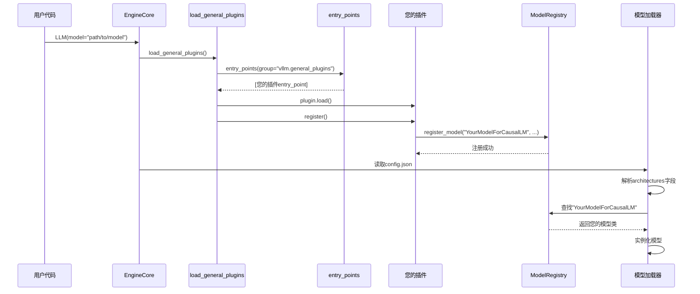
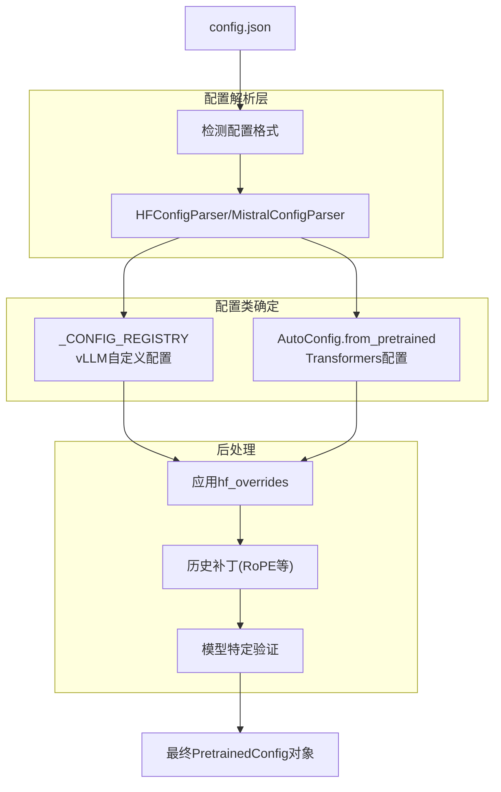

# DeepWiki Q&A with Code Context for Repository: vllm-project/vllm
## Q1
如何在vllm中，以插件形式注册自己的自定义模型？需要注意什么？
请你给出完整操作流程和代码。

中文回答
### Answer
# 在vLLM中以插件形式注册自定义模型

您询问的是如何在vLLM中通过插件系统注册自定义模型。<cite></cite>这是一个外部扩展(out-of-tree)模型的注册方式,无需修改vLLM核心代码库。 vllm:21-23 

## 完整操作流程

### 1. 实现自定义模型类

首先,您需要实现符合vLLM规范的模型类。 vllm:14-16 关键要求包括:

**构造函数签名**:必须使用统一的构造函数签名 vllm:179-181 

```python
def __init__(self, *, vllm_config: VllmConfig, prefix: str = ""):
```

**前缀参数**:所有模块必须包含`prefix`参数,用于运行时支持和非均匀量化 vllm:20-24 

### 2. 创建插件包

创建一个Python包来封装您的模型和注册逻辑。 vllm:11-11 

**目录结构示例**:
```
my_vllm_plugin/
├── setup.py
└── my_vllm_plugin/
    ├── __init__.py
    └── my_model.py
```

### 3. 实现注册函数

在`__init__.py`中实现注册入口函数: vllm:25-34 

```python
# my_vllm_plugin/__init__.py
def register():
    from vllm import ModelRegistry
    from your_code import YourModelForCausalLM

    ModelRegistry.register_model("YourModelForCausalLM", YourModelForCausalLM)
```

**重要提示**:如果您的模型导入了初始化CUDA的模块,应使用延迟导入避免错误 vllm:36-46 :

```python
def register():
    from vllm import ModelRegistry

    ModelRegistry.register_model(
        "YourModelForCausalLM",
        "your_code:YourModelForCausalLM",  # 使用字符串形式延迟导入
    )
```

### 4. 配置setup.py

在`setup.py`中注册插件入口点 vllm:15-26 :

```python
from setuptools import setup

setup(
    name='my_vllm_plugin',
    version='0.1',
    packages=['my_vllm_plugin'],
    entry_points={
        'vllm.general_plugins': [
            "register_my_model = my_vllm_plugin:register"
        ]
    }
)
```

### 5. 安装插件

```bash
pip install -e .
```

### 6. 使用自定义模型

安装后,vLLM会自动加载插件 vllm:7-7 :

```python
from vllm import LLM

llm = LLM(model="path/to/your/model")
output = llm.generate("Hello, my name is")
```

您也可以通过环境变量控制加载哪些插件 vllm:43-43 :

```bash
export VLLM_PLUGINS="register_my_model"
```

## 关键注意事项

### 1. 模型接口要求

- **多模态模型**:如果是多模态模型,必须实现`SupportsMultiModal`接口 vllm:49-51 
- **构造函数**:必须使用关键字参数形式的统一构造函数 vllm:183-183 

### 2. CUDA初始化问题

避免在导入时初始化CUDA,否则会遇到`RuntimeError: Cannot re-initialize CUDA in forked subprocess`错误。 vllm:36-36 使用字符串形式的延迟导入可以解决此问题。 vllm:43-46 

### 3. 插件可重入性

注册函数必须是可重入的,因为可能在某些进程中被多次调用。 vllm:58-58 参考示例中的检查逻辑 vllm:11-12 :

```python
if "MyModelForCausalLM" not in ModelRegistry.get_supported_archs():
    ModelRegistry.register_model("MyModelForCausalLM", MyModelForCausalLM)
```

### 4. 兼容性保证

vLLM保证`ModelRegistry.register_model`接口的稳定性,但您需要确保模型实现与目标vLLM版本兼容。 vllm:60-62 

## 完整示例参考

vLLM提供了完整的测试插件示例 vllm:1-22 ,展示了直接传递模型类和延迟导入两种方式。 vllm:26-42 

## Notes

插件系统使用Python标准的`entry_points`机制 vllm:11-11 ,每个vLLM进程启动时都会加载插件 vllm:7-7 。除了模型注册,vLLM还支持平台插件、IO处理器插件和统计日志插件等其他类型。 vllm:46-54 

Wiki pages you might want to explore:
- [Model Support (vllm-project/vllm)](/wiki/vllm-project/vllm#3)
### Citations
**File:** docs/contributing/model/registration.md (L21-23)
```markdown
## Out-of-tree models

You can load an external model [using a plugin](../../design/plugin_system.md) without modifying the vLLM codebase.
```
**File:** docs/contributing/model/registration.md (L25-34)
```markdown
To register the model, use the following code:

```python
# The entrypoint of your plugin
def register():
    from vllm import ModelRegistry
    from your_code import YourModelForCausalLM

    ModelRegistry.register_model("YourModelForCausalLM", YourModelForCausalLM)
```
```
**File:** docs/contributing/model/registration.md (L36-46)
```markdown
If your model imports modules that initialize CUDA, consider lazy-importing it to avoid errors like `RuntimeError: Cannot re-initialize CUDA in forked subprocess`:

```python
# The entrypoint of your plugin
def register():
    from vllm import ModelRegistry

    ModelRegistry.register_model(
        "YourModelForCausalLM",
        "your_code:YourModelForCausalLM",
    )
```
**File:** docs/contributing/model/registration.md (L49-51)
```markdown
!!! important
    If your model is a multimodal model, ensure the model class implements the [SupportsMultiModal][vllm.model_executor.models.interfaces.SupportsMultiModal] interface.
```
**File:** docs/contributing/model/basic.md (L14-16)
```markdown
## 2. Make your code compatible with vLLM

To ensure compatibility with vLLM, your model must meet the following requirements:
```
**File:** docs/contributing/model/basic.md (L20-24)
```markdown
All vLLM modules within the model must include a `prefix` argument in their constructor. This `prefix` is typically the full name of the module in the model's state dictionary and is crucial for:

- Runtime support: vLLM's attention operators are registered in a model's state by their full names. Each attention operator must have a unique prefix as its layer name to avoid conflicts.
- Non-uniform quantization support: A quantized checkpoint can selectively quantize certain layers while keeping others in full precision. By providing the `prefix` during initialization, vLLM can match the current layer's `prefix` with the quantization configuration to determine if the layer should be initialized in quantized mode.

```
**File:** docs/design/arch_overview.md (L179-181)
```markdown
    ```python
    def __init__(self, *, vllm_config: VllmConfig, prefix: str = ""):
    ```
```
**File:** docs/design/arch_overview.md (L183-183)
```markdown
    To avoid accidentally passing incorrect arguments, the constructor is now keyword-only. This ensures that the constructor will raise an error if old configurations are passed. vLLM developers have already made this change for all models within vLLM. For out-of-tree registered models, developers need to update their models, for example by adding shim code to adapt the old constructor signature to the new one:
```
**File:** docs/design/plugin_system.md (L7-7)
```markdown
Plugins are user-registered code that vLLM executes. Given vLLM's architecture (see [Arch Overview](arch_overview.md)), multiple processes may be involved, especially when using distributed inference with various parallelism techniques. To enable plugins successfully, every process created by vLLM needs to load the plugin. This is done by the [load_general_plugins](https://github.com/vllm-project/vllm/blob/c76ac49d266e27aa3fea84ef2df1f813d24c91c7/vllm/plugins/__init__.py#L16) function in the `vllm.plugins` module. This function is called for every process created by vLLM before it starts any work.
```
**File:** docs/design/plugin_system.md (L11-11)
```markdown
vLLM's plugin system uses the standard Python `entry_points` mechanism. This mechanism allows developers to register functions in their Python packages for use by other packages. An example of a plugin:
```
**File:** docs/design/plugin_system.md (L15-26)
```markdown
    ```python
    # inside `setup.py` file
    from setuptools import setup

    setup(name='vllm_add_dummy_model',
        version='0.1',
        packages=['vllm_add_dummy_model'],
        entry_points={
            'vllm.general_plugins':
            ["register_dummy_model = vllm_add_dummy_model:register"]
        })

```
**File:** docs/design/plugin_system.md (L43-43)
```markdown
2. **Plugin name**: The name of the plugin. This is the value in the dictionary of the `entry_points` dictionary. In the example above, the plugin name is `register_dummy_model`. Plugins can be filtered by their names using the `VLLM_PLUGINS` environment variable. To load only a specific plugin, set `VLLM_PLUGINS` to the plugin name.
```
**File:** docs/design/plugin_system.md (L46-54)
```markdown
## Types of supported plugins

- **General plugins** (with group name `vllm.general_plugins`): The primary use case for these plugins is to register custom, out-of-the-tree models into vLLM. This is done by calling `ModelRegistry.register_model` to register the model inside the plugin function.

- **Platform plugins** (with group name `vllm.platform_plugins`): The primary use case for these plugins is to register custom, out-of-the-tree platforms into vLLM. The plugin function should return `None` when the platform is not supported in the current environment, or the platform class's fully qualified name when the platform is supported.

- **IO Processor plugins** (with group name `vllm.io_processor_plugins`): The primary use case for these plugins is to register custom pre/post processing of the model prompt and model output for pooling models. The plugin function returns the IOProcessor's class fully qualified name.

- **Stat logger plugins** (with group name `vllm.stat_logger_plugins`): The primary use case for these plugins is to register custom, out-of-the-tree loggers into vLLM. The entry point should be a class that subclasses StatLoggerBase.
```
**File:** docs/design/plugin_system.md (L58-58)
```markdown
- **Being re-entrant**: The function specified in the entry point should be re-entrant, meaning it can be called multiple times without causing issues. This is necessary because the function might be called multiple times in some processes.
```
**File:** docs/design/plugin_system.md (L60-62)
```markdown
## Compatibility Guarantee

```
**File:** tests/plugins/vllm_add_dummy_model/vllm_add_dummy_model/__init__.py (L1-22)
```python
# SPDX-License-Identifier: Apache-2.0
# SPDX-FileCopyrightText: Copyright contributors to the vLLM project

from vllm import ModelRegistry


def register():
    # Test directly passing the model
    from .my_opt import MyOPTForCausalLM

    if "MyOPTForCausalLM" not in ModelRegistry.get_supported_archs():
        ModelRegistry.register_model("MyOPTForCausalLM", MyOPTForCausalLM)

    # Test passing lazy model
    if "MyGemma2Embedding" not in ModelRegistry.get_supported_archs():
        ModelRegistry.register_model(
            "MyGemma2Embedding",
            "vllm_add_dummy_model.my_gemma_embedding:MyGemma2Embedding",
        )

    if "MyLlava" not in ModelRegistry.get_supported_archs():
        ModelRegistry.register_model("MyLlava", "vllm_add_dummy_model.my_llava:MyLlava")
```
**File:** tests/models/test_oot_registration.py (L26-42)
```python
def test_oot_registration_text_generation(
    monkeypatch: pytest.MonkeyPatch,
    dummy_opt_path: str,
):
    with monkeypatch.context() as m:
        m.setenv("VLLM_PLUGINS", "register_dummy_model")
        prompts = ["Hello, my name is", "The text does not matter"]
        sampling_params = SamplingParams(temperature=0)
        llm = LLM(model=dummy_opt_path, load_format="dummy")
        first_token = llm.get_tokenizer().decode(0)
        outputs = llm.generate(prompts, sampling_params)

        for output in outputs:
            generated_text = output.outputs[0].text
            # make sure only the first token is generated
            rest = generated_text.replace(first_token, "")
            assert rest == ""
```
## Q2
vllm 是如何识别到我的自定义插件，以及根据什么信息识别出我启动的模型需要用对应的插件运行？
请给出vllm在这个流程中的执行逻辑。
### Answer
# vLLM插件识别和模型匹配的执行逻辑

您询问的是vLLM如何发现插件以及如何将模型与插件关联起来。<cite/>这涉及两个核心流程:插件发现机制和模型注册匹配。<cite/>

## 插件发现流程

### 1. 插件加载入口

vLLM在每个进程启动时都会调用`load_general_plugins()`函数来加载插件 vllm:7-7 : vllm:86-89 

这个调用发生在`EngineCore`初始化时 vllm:79-89 ,确保所有进程都能加载插件。<cite/>

### 2. 通过entry_points发现插件

`load_general_plugins()`内部调用`load_plugins_by_group()`来发现已安装的插件 vllm:75-78 : vllm:25-30 

这里使用Python标准库的`importlib.metadata.entry_points()`来查找所有注册在`vllm.general_plugins`组下的插件 vllm:26-33 。<cite/>

### 3. 插件过滤和加载

系统会检查`VLLM_PLUGINS`环境变量来决定加载哪些插件 vllm:28-28 : vllm:44-62 

如果`VLLM_PLUGINS`未设置,所有发现的插件都会被加载;如果设置了,只加载指定名称的插件。<cite/>

### 4. 执行注册函数

加载的插件函数会被立即执行 vllm:76-78 :

```python
for func in plugins.values():
    func()  # 执行注册函数,如register()
```

这时您的`register()`函数会被调用,将模型类注册到`ModelRegistry`中。<cite/>

## 模型匹配流程

### 1. 模型架构识别

当您使用`LLM(model="path/to/model")`初始化时,vLLM会读取模型的`config.json`文件 vllm:11-11 。<cite/>

配置文件中的`architectures`字段(例如`["YourModelForCausalLM"]`)会被用来查找对应的模型实现。<cite/>

### 2. 在ModelRegistry中查找

vLLM会在`ModelRegistry`中查找与`architectures`字段匹配的模型类 vllm:3-3 。<cite/>由于您的插件已经通过`ModelRegistry.register_model("YourModelForCausalLM", YourModelForCausalLM)`注册了模型,系统能够找到对应的实现。<cite/>

### 3. 延迟加载机制

如果您使用字符串形式注册(如`"your_code:YourModelForCausalLM"`),vLLM会在实际需要时才导入模型类 vllm:42-46 ,避免CUDA重初始化问题。<cite/>

## 完整执行时序



## 关键识别点

1. **插件名称识别**:通过`setup.py`中`entry_points`的键值对,如`"register_my_model = my_vllm_plugin:register"` vllm:22-25 

2. **模型架构识别**:通过模型`config.json`中的`architectures`字段与`ModelRegistry`中注册的名称匹配 vllm:30-33 

3. **环境变量控制**:`VLLM_PLUGINS`可以精确控制加载哪些插件 vllm:52-54 

## Notes

插件系统的设计确保了可重入性 vllm:70-73 ,因为在分布式推理场景下,多个进程可能会多次加载同一插件 vllm:58-58 。<cite/>测试用例`test_oot_registration.py`展示了完整的插件加载和模型使用流程 vllm:26-42 。<cite/>

Wiki pages you might want to explore:
- [Overview (vllm-project/vllm)](/wiki/vllm-project/vllm#1)
### Citations
**File:** docs/design/plugin_system.md (L7-7)
```markdown
Plugins are user-registered code that vLLM executes. Given vLLM's architecture (see [Arch Overview](arch_overview.md)), multiple processes may be involved, especially when using distributed inference with various parallelism techniques. To enable plugins successfully, every process created by vLLM needs to load the plugin. This is done by the [load_general_plugins](https://github.com/vllm-project/vllm/blob/c76ac49d266e27aa3fea84ef2df1f813d24c91c7/vllm/plugins/__init__.py#L16) function in the `vllm.plugins` module. This function is called for every process created by vLLM before it starts any work.
```
**File:** docs/design/plugin_system.md (L11-11)
```markdown
vLLM's plugin system uses the standard Python `entry_points` mechanism. This mechanism allows developers to register functions in their Python packages for use by other packages. An example of a plugin:
```
**File:** docs/design/plugin_system.md (L22-25)
```markdown
        entry_points={
            'vllm.general_plugins':
            ["register_dummy_model = vllm_add_dummy_model:register"]
        })
```
**File:** docs/design/plugin_system.md (L58-58)
```markdown
- **Being re-entrant**: The function specified in the entry point should be re-entrant, meaning it can be called multiple times without causing issues. This is necessary because the function might be called multiple times in some processes.
```
**File:** vllm/v1/engine/core.py (L79-89)
```python
    def __init__(
        self,
        vllm_config: VllmConfig,
        executor_class: type[Executor],
        log_stats: bool,
        executor_fail_callback: Callable | None = None,
    ):
        # plugins need to be loaded at the engine/scheduler level too
        from vllm.plugins import load_general_plugins

        load_general_plugins()
```
**File:** vllm/plugins/__init__.py (L25-33)
```python
def load_plugins_by_group(group: str) -> dict[str, Callable[[], Any]]:
    from importlib.metadata import entry_points

    allowed_plugins = envs.VLLM_PLUGINS

    discovered_plugins = entry_points(group=group)
    if len(discovered_plugins) == 0:
        logger.debug("No plugins for group %s found.", group)
        return {}
```
**File:** vllm/plugins/__init__.py (L44-62)
```python
    if allowed_plugins is None:
        log_level(
            "All plugins in this group will be loaded. "
            "Set `VLLM_PLUGINS` to control which plugins to load."
        )

    plugins = dict[str, Callable[[], Any]]()
    for plugin in discovered_plugins:
        if allowed_plugins is None or plugin.name in allowed_plugins:
            if allowed_plugins is not None:
                log_level("Loading plugin %s", plugin.name)

            try:
                func = plugin.load()
                plugins[plugin.name] = func
            except Exception:
                logger.exception("Failed to load plugin %s", plugin.name)

    return plugins
```
**File:** vllm/plugins/__init__.py (L70-73)
```python
    global plugins_loaded
    if plugins_loaded:
        return
    plugins_loaded = True
```
**File:** vllm/plugins/__init__.py (L75-78)
```python
    plugins = load_plugins_by_group(group=DEFAULT_PLUGINS_GROUP)
    # general plugins, we only need to execute the loaded functions
    for func in plugins.values():
        func()
```
**File:** docs/contributing/model/registration.md (L3-3)
```markdown
vLLM relies on a model registry to determine how to run each model.
```
**File:** docs/contributing/model/registration.md (L30-33)
```markdown
    from vllm import ModelRegistry
    from your_code import YourModelForCausalLM

    ModelRegistry.register_model("YourModelForCausalLM", YourModelForCausalLM)
```
**File:** docs/contributing/model/registration.md (L42-46)
```markdown

    ModelRegistry.register_model(
        "YourModelForCausalLM",
        "your_code:YourModelForCausalLM",
    )
```
**File:** tests/models/test_oot_registration.py (L26-42)
```python
def test_oot_registration_text_generation(
    monkeypatch: pytest.MonkeyPatch,
    dummy_opt_path: str,
):
    with monkeypatch.context() as m:
        m.setenv("VLLM_PLUGINS", "register_dummy_model")
        prompts = ["Hello, my name is", "The text does not matter"]
        sampling_params = SamplingParams(temperature=0)
        llm = LLM(model=dummy_opt_path, load_format="dummy")
        first_token = llm.get_tokenizer().decode(0)
        outputs = llm.generate(prompts, sampling_params)

        for output in outputs:
            generated_text = output.outputs[0].text
            # make sure only the first token is generated
            rest = generated_text.replace(first_token, "")
            assert rest == ""
```
## Q3
注册一个自定义的vllm模型，需要遵循哪些规范？需要满足哪些条件？
### Answer
# 注册自定义vLLM模型的规范和条件

您询问的是在vLLM中注册自定义模型需要遵循的规范和满足的条件。<cite/>这涉及模型接口、构造函数签名、计算逻辑等多个方面的要求。<cite/>

## 核心规范要求

### 1. 统一的构造函数签名

所有vLLM模型必须使用统一的构造函数签名,这是最基本的要求 vllm:177-181 :

```python
def __init__(self, *, vllm_config: VllmConfig, prefix: str = ""):
```

**关键点**:
- 必须使用关键字参数(`*`强制) vllm:183-183 
- `vllm_config`包含所有配置信息 vllm:151-162 
- `prefix`参数用于权重加载和量化 vllm:230-236 

如果您的模型使用旧式构造函数,需要添加适配层 vllm:185-215 。<cite/>

### 2. 模型接口实现

您的模型必须实现`VllmModel`协议 vllm:40-61 :

**必需方法**:

- `__init__(vllm_config, prefix)`: 构造函数 vllm:44-48 
- `get_input_embeddings(input_ids)`: 返回文本嵌入 vllm:50-55 
- `forward(input_ids, positions)`: 前向计算 vllm:57-61 

### 3. 前缀参数传递

所有子模块必须包含`prefix`参数并正确传递 vllm:20-23 :

```python
class MyDecoderLayer(nn.Module):
    def __init__(self, vllm_config: VllmConfig, prefix: str):
        super().__init__()
        self.self_attn = MyAttention(prefix=f"{prefix}.self_attn")
```

**原因**:
- 注意力算子需要唯一的层名称 vllm:22-22 
- 支持非均匀量化 vllm:23-23 

### 4. 前向方法签名

`forward`方法必须使用扁平化的输入张量 vllm:69-80 :

```python
def forward(
    self,
    input_ids: torch.Tensor,  # 形状: (batch_size,)
    positions: torch.Tensor,   # 形状: (batch_size,)
    intermediate_tensors: IntermediateTensors | None = None,
    inputs_embeds: torch.Tensor | None = None,
) -> torch.Tensor:
```

**注意**: 不要使用`(batch_size, seq_len)`的二维形状 vllm:69-69 。<cite/>

## 特定类型模型的额外要求

### 多模态模型

如果是多模态模型,必须实现`SupportsMultiModal`接口 vllm:49-50 :

```python
from vllm.model_executor.models.interfaces import SupportsMultiModal

class YourMultiModalModel(nn.Module, SupportsMultiModal):
    ...
```

这个接口在`vllm/model_executor/models/__init__.py`中导出 vllm:8-8 。<cite/>

### Transformers后端兼容模型

如果希望通过Transformers后端运行,需要满足 vllm:75-80 :

1. `kwargs`从`MyModel`传递到`MyAttention` vllm:77-77 
2. `MyAttention`使用`ALL_ATTENTION_FUNCTIONS` vllm:79-79 
3. `MyModel`包含`_supports_attention_backend = True` vllm:80-80 

## 权重加载要求

### 实现load_weights方法

您需要在模型类中实现`load_weights`方法 vllm:105-106 :

```python
def load_weights(self, weights: Iterable[tuple[str, torch.Tensor]]) -> set[str]:
    # 加载权重逻辑
    ...
```

vLLM提供了`AutoWeightsLoader`辅助类简化权重加载 vllm:315-329 。<cite/>

### 张量并行支持

如果模型需要张量并行,使用vLLM提供的并行层 vllm:90-100 :

- `VocabParallelEmbedding`: 词嵌入层
- `ParallelLMHead`: 输出层
- `RowParallelLinear`: 行并行线性层
- `ColumnParallelLinear`: 列并行线性层
- `QKVParallelLinear`: QKV投影层

## 模型初始化验证

vLLM会在初始化时检查构造函数签名 vllm:50-64 :

```python
signatures = inspect.signature(model_class.__init__)
all_params = [param.name for param in signatures.parameters.values()]
if "vllm_config" in all_params and "prefix" in all_params:
    # 新式模型类
    return model_class(vllm_config=vllm_config, prefix=prefix)
```

如果不满足要求,会发出警告并尝试兼容旧式模型 vllm:57-64 。<cite/>

## 注册要求

### 架构名称匹配

注册时使用的架构名称必须与模型`config.json`中的`architectures`字段匹配 vllm:3-3 :

```python
# config.json中:
{
  "architectures": ["YourModelForCausalLM"],
  ...
}

# 注册时:
ModelRegistry.register_model("YourModelForCausalLM", YourModelForCausalLM)
```

### 可重入性

注册函数必须是可重入的 vllm:58-58 :

```python
def register():
    from vllm import ModelRegistry
    if "YourModel" not in ModelRegistry.get_supported_archs():
        ModelRegistry.register_model("YourModel", YourModel)
```

## 实际示例参考

vLLM代码库中有大量模型实现可供参考:

- **基础模型**: `llama.py`展示了标准的解码器模型实现 vllm:86-86 
- **多模态模型**: `phi3v.py` vllm:1-74 , `mllama4.py` vllm:1-75 展示了视觉-语言模型
- **特殊架构**: `llama_eagle.py` vllm:1-50 展示了推测解码模型

## Notes

模型实现的质量要求根据测试级别不同 vllm:821-826 :严格一致性测试要求与HuggingFace Transformers输出完全一致,而运行时功能测试只要求模型能正常加载运行。<cite/>社区贡献的模型主要关注输出的合理性而非严格一致性 vllm:804-806 。<cite/>

Wiki pages you might want to explore:
- [Model Support (vllm-project/vllm)](/wiki/vllm-project/vllm#3)
### Citations
**File:** docs/design/arch_overview.md (L151-162)
```markdown
containing all the necessary information. The [VllmConfig](https://github.com/vllm-project/vllm/blob/d1c6799b8870e513bf4f2305cbf6cda9fc3d773b/vllm/config.py#L2036)
class is the main configuration object that is passed around. The class
hierarchy is quite deep, and every class needs to read the configuration it is
interested in. By encapsulating all configurations in one object, we can easily
pass the configuration object around and access the configuration we need.
Suppose we want to add a new feature (this is often the case given how fast the
field of LLM inference is evolving) that only touches the model runner. We will
have to add a new configuration option in the `VllmConfig` class. Since we pass
the whole config object around, we only need to add the configuration option to
the `VllmConfig` class, and the model runner can access it directly. We don't
need to change the constructor of the engine, worker, or model class to pass the
new configuration option.
```
**File:** docs/design/arch_overview.md (L177-181)
```markdown
    To support this change, all vLLM models' signatures have been updated to:

    ```python
    def __init__(self, *, vllm_config: VllmConfig, prefix: str = ""):
    ```
```
**File:** docs/design/arch_overview.md (L183-183)
```markdown
    To avoid accidentally passing incorrect arguments, the constructor is now keyword-only. This ensures that the constructor will raise an error if old configurations are passed. vLLM developers have already made this change for all models within vLLM. For out-of-tree registered models, developers need to update their models, for example by adding shim code to adapt the old constructor signature to the new one:
```
**File:** docs/design/arch_overview.md (L185-215)
```markdown
    ??? code

        ```python
        class MyOldModel(nn.Module):
            def __init__(
                self,
                config,
                cache_config: Optional[CacheConfig] = None,
                quant_config: Optional[QuantizationConfig] = None,
                lora_config: Optional[LoRAConfig] = None,
                prefix: str = "",
            ) -> None:
                ...

        from vllm.config import VllmConfig
        class MyNewModel(MyOldModel):
            def __init__(self, *, vllm_config: VllmConfig, prefix: str = ""):
                config = vllm_config.model_config.hf_config
                cache_config = vllm_config.cache_config
                quant_config = vllm_config.quant_config
                lora_config = vllm_config.lora_config
                super().__init__(config, cache_config, quant_config, lora_config, prefix)

        from packaging import version
        if version.parse(__version__) >= version.parse("0.6.4"):
            MyModel = MyNewModel
        else:
            MyModel = MyOldModel
        ```

    This way, the model can work with both old and new versions of vLLM.
```
**File:** docs/design/arch_overview.md (L230-236)
```markdown
applies to quantization. Note that we also add an additional argument `prefix`
to the model's constructor so that the model can initialize itself differently
based on the prefix. This is useful for non-uniform quantization, where
different parts of the model are quantized differently. The `prefix` is
usually an empty string for the top-level model and a string like `"vision"`
or `"language"` for the sub-models. In general, it matches the name of the
module's state dict in the checkpoint file.
```
**File:** vllm/model_executor/models/interfaces_base.py (L40-61)
```python
@runtime_checkable
class VllmModel(Protocol[T_co]):
    """The interface required for all models in vLLM."""

    def __init__(
        self,
        vllm_config: VllmConfig,
        prefix: str = "",
    ) -> None: ...

    def get_input_embeddings(
        self,
        input_ids: torch.Tensor,
    ) -> torch.Tensor:
        """Apply token embeddings to `input_ids`."""
        ...

    def forward(
        self,
        input_ids: torch.Tensor,
        positions: torch.Tensor,
    ) -> T_co: ...
```
**File:** docs/contributing/model/basic.md (L20-23)
```markdown
All vLLM modules within the model must include a `prefix` argument in their constructor. This `prefix` is typically the full name of the module in the model's state dictionary and is crucial for:

- Runtime support: vLLM's attention operators are registered in a model's state by their full names. Each attention operator must have a unique prefix as its layer name to avoid conflicts.
- Non-uniform quantization support: A quantized checkpoint can selectively quantize certain layers while keeping others in full precision. By providing the `prefix` during initialization, vLLM can match the current layer's `prefix` with the quantization configuration to determine if the layer should be initialized in quantized mode.
```
**File:** docs/contributing/model/basic.md (L69-80)
```markdown
- Rewrite the [forward][torch.nn.Module.forward] method of your model to remove any unnecessary code, such as training-specific code. Modify the input parameters to treat `input_ids` and `positions` as flattened tensors with a single batch size dimension, without a max-sequence length dimension.

```python
def forward(
    self,
    input_ids: torch.Tensor,
    positions: torch.Tensor,
    intermediate_tensors: IntermediateTensors | None = None,
    inputs_embeds: torch.Tensor | None = None,
) -> torch.Tensor:
    ...
```
```
**File:** docs/contributing/model/basic.md (L86-86)
```markdown
For reference, check out our [Llama implementation](../../../vllm/model_executor/models/llama.py). vLLM already supports a large number of models. It is recommended to find a model similar to yours and adapt it to your model's architecture. Check out [vllm/model_executor/models](../../../vllm/model_executor/models) for more examples.
```
**File:** docs/contributing/model/basic.md (L90-100)
```markdown
If your model is too large to fit into a single GPU, you can use tensor parallelism to manage it.
To do this, substitute your model's linear and embedding layers with their tensor-parallel versions.
For the embedding layer, you can simply replace [torch.nn.Embedding][] with `VocabParallelEmbedding`. For the output LM head, you can use `ParallelLMHead`.
When it comes to the linear layers, we provide the following options to parallelize them:

- `ReplicatedLinear`: Replicates the inputs and weights across multiple GPUs. No memory saving.
- `RowParallelLinear`: The input tensor is partitioned along the hidden dimension. The weight matrix is partitioned along the rows (input dimension). An *all-reduce* operation is performed after the matrix multiplication to reduce the results. Typically used for the second FFN layer and the output linear transformation of the attention layer.
- `ColumnParallelLinear`: The input tensor is replicated. The weight matrix is partitioned along the columns (output dimension). The result is partitioned along the column dimension. Typically used for the first FFN layer and the separated QKV transformation of the attention layer in the original Transformer.
- `MergedColumnParallelLinear`: Column-parallel linear that merges multiple `ColumnParallelLinear` operators. Typically used for the first FFN layer with weighted activation functions (e.g., SiLU). This class handles the sharded weight loading logic of multiple weight matrices.
- `QKVParallelLinear`: Parallel linear layer for the query, key, and value projections of the multi-head and grouped-query attention mechanisms. When number of key/value heads are less than the world size, this class replicates the key/value heads properly. This class handles the weight loading and replication of the weight matrices.

```
**File:** docs/contributing/model/basic.md (L105-106)
```markdown
You now need to implement the `load_weights` method in your `*ForCausalLM` class.
This method should load the weights from the HuggingFace's checkpoint file and assign them to the corresponding layers in your model. Specifically, for `MergedColumnParallelLinear` and `QKVParallelLinear` layers, if the original model has separated weight matrices, you need to load the different parts separately.
```
**File:** docs/contributing/model/registration.md (L3-3)
```markdown
vLLM relies on a model registry to determine how to run each model.
```
**File:** docs/contributing/model/registration.md (L49-50)
```markdown
!!! important
    If your model is a multimodal model, ensure the model class implements the [SupportsMultiModal][vllm.model_executor.models.interfaces.SupportsMultiModal] interface.
```
**File:** vllm/model_executor/models/__init__.py (L8-8)
```python
    SupportsMultiModal,
```
**File:** docs/models/supported_models.md (L75-80)
```markdown
To make your model compatible with the Transformers backend, it needs:

1. `kwargs` passed down through all modules from `MyModel` to `MyAttention`.
    1. If your model is encoder-only, you must also add `is_causal = False` to `MyAttention`.
2. `MyAttention` must use `ALL_ATTENTION_FUNCTIONS` to call attention.
3. `MyModel` must contain `_supports_attention_backend = True`.
```
**File:** docs/models/supported_models.md (L804-806)
```markdown
1. **Community-Driven Support**: We encourage community contributions for adding new models. When a user requests support for a new model, we welcome pull requests (PRs) from the community. These contributions are evaluated primarily on the sensibility of the output they generate, rather than strict consistency with existing implementations such as those in transformers. **Call for contribution:** PRs coming directly from model vendors are greatly appreciated!

2. **Best-Effort Consistency**: While we aim to maintain a level of consistency between the models implemented in vLLM and other frameworks like transformers, complete alignment is not always feasible. Factors like acceleration techniques and the use of low-precision computations can introduce discrepancies. Our commitment is to ensure that the implemented models are functional and produce sensible results.
```
**File:** docs/models/supported_models.md (L821-826)
```markdown
We have the following levels of testing for models:

1. **Strict Consistency**: We compare the output of the model with the output of the model in the HuggingFace Transformers library under greedy decoding. This is the most stringent test. Please refer to [models tests](https://github.com/vllm-project/vllm/blob/main/tests/models) for the models that have passed this test.
2. **Output Sensibility**: We check if the output of the model is sensible and coherent, by measuring the perplexity of the output and checking for any obvious errors. This is a less stringent test.
3. **Runtime Functionality**: We check if the model can be loaded and run without errors. This is the least stringent test. Please refer to [functionality tests](../../tests) and [examples](../../examples) for the models that have passed this test.
```
**File:** vllm/model_executor/models/utils.py (L315-329)
```python
    def load_weights(
        self,
        weights: Iterable[tuple[str, torch.Tensor]],
        *,
        mapper: WeightsMapper | None = None,
    ) -> set[str]:
        if mapper is not None:
            weights = mapper.apply(weights)
        # filter out weights with first-prefix/substr to skip in name
        weights = (
            (name, weight) for name, weight in weights if not self._can_skip(name)
        )

        autoloaded_weights = set(self._load_module("", self.module, weights))
        return autoloaded_weights
```
**File:** vllm/model_executor/model_loader/utils.py (L50-64)
```python
    signatures = inspect.signature(model_class.__init__)
    all_params = [param.name for param in signatures.parameters.values()]
    if "vllm_config" in all_params and "prefix" in all_params:
        # new-style model class
        with set_current_vllm_config(vllm_config, check_compile=True, prefix=prefix):
            return model_class(vllm_config=vllm_config, prefix=prefix)

    msg = (
        "vLLM model class should accept `vllm_config` and `prefix` as "
        "input arguments. Possibly you have an old-style model class"
        " registered from out of tree and it is used for new vLLM version. "
        "Check https://docs.vllm.ai/en/latest/design/arch_overview.html "
        "for the design and update the model class accordingly."
    )
    warnings.warn(msg, DeprecationWarning, stacklevel=2)
```
**File:** docs/design/plugin_system.md (L58-58)
```markdown
- **Being re-entrant**: The function specified in the entry point should be re-entrant, meaning it can be called multiple times without causing issues. This is necessary because the function might be called multiple times in some processes.
```
**File:** vllm/model_executor/models/phi3v.py (L1-74)
```python
# SPDX-License-Identifier: Apache-2.0
# SPDX-FileCopyrightText: Copyright contributors to the vLLM project

# Copyright 2024 The vLLM team.
# Copyright 2024 Microsoft and the HuggingFace Inc. team. All rights reserved.
#
# Licensed under the Apache License, Version 2.0 (the "License");
# you may not use this file except in compliance with the License.
# You may obtain a copy of the License at
#
#     http://www.apache.org/licenses/LICENSE-2.0
#
# Unless required by applicable law or agreed to in writing, software
# distributed under the License is distributed on an "AS IS" BASIS,
# WITHOUT WARRANTIES OR CONDITIONS OF ANY KIND, either express or implied.
# See the License for the specific language governing permissions and
# limitations under the License.
from collections.abc import Iterable, Mapping, Sequence
from typing import Annotated, Any, Literal, TypeAlias

import regex as re
import torch
import torch.nn as nn
from transformers import (
    BatchFeature,
    CLIPVisionConfig,
    PretrainedConfig,
    ProcessorMixin,
)

from vllm.config import VllmConfig
from vllm.config.multimodal import BaseDummyOptions
from vllm.logger import init_logger
from vllm.model_executor.layers.quantization import QuantizationConfig
from vllm.model_executor.layers.vocab_parallel_embedding import VocabParallelEmbedding
from vllm.multimodal import MULTIMODAL_REGISTRY
from vllm.multimodal.inputs import (
    MultiModalDataDict,
    MultiModalFieldConfig,
    MultiModalKwargsItems,
)
from vllm.multimodal.parse import (
    ImageEmbeddingItems,
    ImageProcessorItems,
    ImageSize,
    MultiModalDataItems,
)
from vllm.multimodal.processing import (
    BaseMultiModalProcessor,
    BaseProcessingInfo,
    MultiModalPromptUpdates,
    PlaceholderFeaturesInfo,
    PromptReplacement,
    PromptUpdate,
    ResolvedPromptUpdate,
)
from vllm.multimodal.profiling import BaseDummyInputsBuilder
from vllm.sequence import IntermediateTensors
from vllm.utils.tensor_schema import TensorSchema, TensorShape

from .clip import CLIPVisionModel
from .interfaces import (
    MultiModalEmbeddings,
    SupportsMultiModal,
    SupportsPP,
    SupportsQuant,
)
from .utils import (
    AutoWeightsLoader,
    WeightsMapper,
    _merge_multimodal_embeddings,
    init_vllm_registered_model,
    maybe_prefix,
)
```
**File:** vllm/model_executor/models/mllama4.py (L1-75)
```python
# SPDX-License-Identifier: Apache-2.0
# SPDX-FileCopyrightText: Copyright contributors to the vLLM project
#
# Copyright 2025 the LLAMA4, Meta Inc., vLLM, and HuggingFace Inc. team.
# All rights reserved.
#
#
# Licensed under the Apache License, Version 2.0 (the "License");
# you may not use this file except in compliance with the License.
# You may obtain a copy of the License at
#
#     http://www.apache.org/licenses/LICENSE-2.0
#
# Unless required by applicable law or agreed to in writing, software
# distributed under the License is distributed on an "AS IS" BASIS,
# WITHOUT WARRANTIES OR CONDITIONS OF ANY KIND, either express or implied.
# See the License for the specific language governing permissions and
# limitations under the License.
import math
from collections.abc import Iterable, Mapping
from itertools import tee
from typing import Annotated, Literal

import torch
from torch import nn
from transformers import BatchFeature, Llama4Config, Llama4VisionConfig
from transformers.image_utils import SizeDict
from transformers.models.llama4 import Llama4Processor
from transformers.models.llama4.image_processing_llama4_fast import (
    find_supported_resolutions,
    get_best_fit,
)

from vllm.attention.layer import MultiHeadAttention
from vllm.config import VllmConfig
from vllm.config.multimodal import BaseDummyOptions
from vllm.distributed import get_tensor_model_parallel_world_size
from vllm.model_executor.layers.linear import (
    ColumnParallelLinear,
    QKVParallelLinear,
    ReplicatedLinear,
    RowParallelLinear,
)
from vllm.model_executor.layers.quantization import QuantizationConfig
from vllm.model_executor.layers.rotary_embedding import get_rope
from vllm.model_executor.model_loader.utils import initialize_model
from vllm.model_executor.model_loader.weight_utils import default_weight_loader
from vllm.multimodal import MULTIMODAL_REGISTRY
from vllm.multimodal.inputs import (
    MultiModalDataDict,
    MultiModalFieldConfig,
    MultiModalKwargsItems,
)
from vllm.multimodal.parse import ImageProcessorItems, ImageSize, MultiModalDataItems
from vllm.multimodal.processing import (
    BaseMultiModalProcessor,
    BaseProcessingInfo,
    InputProcessingContext,
    PromptReplacement,
    PromptUpdate,
    PromptUpdateDetails,
)
from vllm.multimodal.profiling import BaseDummyInputsBuilder
from vllm.sequence import IntermediateTensors
from vllm.utils.tensor_schema import TensorSchema, TensorShape

from .interfaces import (
    MultiModalEmbeddings,
    SupportsEagle3,
    SupportsMultiModal,
    SupportsPP,
)
from .llama4 import Llama4ForCausalLM
from .utils import AutoWeightsLoader, maybe_prefix
from .vision import run_dp_sharded_vision_model
```
**File:** vllm/model_executor/models/llama_eagle.py (L1-50)
```python
# SPDX-License-Identifier: Apache-2.0
# SPDX-FileCopyrightText: Copyright contributors to the vLLM project

from collections.abc import Iterable

import torch
import torch.nn as nn
from transformers import LlamaConfig

from vllm.compilation.decorators import support_torch_compile
from vllm.config import VllmConfig
from vllm.distributed.parallel_state import get_pp_group
from vllm.logger import init_logger
from vllm.model_executor.layers.logits_processor import LogitsProcessor
from vllm.model_executor.layers.quantization.base_config import QuantizationConfig
from vllm.model_executor.layers.vocab_parallel_embedding import VocabParallelEmbedding
from vllm.model_executor.model_loader.weight_utils import default_weight_loader
from vllm.model_executor.models.llama import LlamaDecoderLayer, LlamaForCausalLM

from .utils import AutoWeightsLoader, maybe_prefix

logger = init_logger(__name__)


class LlamaDecoderLayer(LlamaDecoderLayer):
    def __init__(
        self,
        vllm_config: VllmConfig,
        disable_input_layernorm: bool,
        prefix: str = "",
        config: LlamaConfig | None = None,
    ) -> None:
        super().__init__(vllm_config, prefix=prefix, config=config)

        # Skip the input_layernorm
        # https://github.com/SafeAILab/EAGLE/blob/35c78f6cdc19a73e05cf5c330b4c358dad970c6a/eagle/model/cnets.py#L427
        if disable_input_layernorm:
            del self.input_layernorm
            self.input_layernorm = nn.Identity()

    def get_quant_config(self, vllm_config: VllmConfig) -> QuantizationConfig | None:
        """Use drafter's quantization config instead of verifier's."""
        draft_model_config = vllm_config.speculative_config.draft_model_config
        draft_load_config = vllm_config.load_config

        return (
            VllmConfig.get_quantization_config(draft_model_config, draft_load_config)
            if draft_model_config
            else None
        )
```
## Q4
我们知道，vllm会读取config.json，而huggingface也会读取config.json。
huggingface往往有一个ModelNameConfiguration class来规范config.json的字段名列表，
那么vllm中，是否会限制约束config.json中的内容？
或者说，vllm对于config.json的解析是否依赖于transformers huggingface定义的config class？
### Answer
# vLLM对config.json的解析和依赖关系

您询问的是vLLM是否限制`config.json`的内容,以及是否依赖HuggingFace Transformers定义的配置类。<cite/>

## 核心答案

**vLLM主要依赖HuggingFace Transformers的配置类,但也有自己的扩展机制。**<cite/>

### 1. 主要依赖Transformers的AutoConfig

vLLM的配置加载流程主要使用HuggingFace的`AutoConfig.from_pretrained()`来解析`config.json` vllm:14-16 :

```python
# 从config.json的model_type字段确定配置类
# 如果model_type不在vLLM的自定义列表中,使用AutoConfig加载
```

这意味着**vLLM继承了Transformers对config.json字段的所有约束和规范** vllm:12-13 。<cite/>

### 2. vLLM的自定义配置注册表

对于某些模型,vLLM维护了自己的配置类注册表`_CONFIG_REGISTRY` vllm:76-101 :

```python
_CONFIG_REGISTRY: dict[str, type[PretrainedConfig]] = LazyConfigDict(
    chatglm="ChatGLMConfig",
    deepseek_vl_v2="DeepseekVLV2Config",
    deepseek_v3="DeepseekV3Config",
    # ... 更多自定义配置
)
```

**这些自定义配置类的目的** vllm:3-8 :
- HuggingFace Hub或Transformers库没有定义配置文件
- 需要覆盖现有配置以支持vLLM特性

### 3. 配置加载的优先级逻辑

在`get_config()`函数中,vLLM按以下顺序处理配置 vllm:558-615 :

1. **检测配置格式**:自动检测是HF格式(`config.json`)还是Mistral格式(`params.json`) vllm:575-588 
2. **加载配置字典**:使用对应的parser解析配置文件
3. **确定配置类**:
   - 如果`model_type`在`_CONFIG_REGISTRY`中,使用vLLM自定义配置类
   - 否则,使用`AutoConfig.from_pretrained()`加载Transformers配置类 vllm:13-16 

### 4. 配置的后处理和覆盖

加载配置后,vLLM会进行额外处理 vllm:673-685 :

- **应用hf_overrides**:允许用户覆盖配置字段 vllm:673-678 
- **补充architectures字段**:如果配置缺少`architectures`字段,从`model_type`推断 vllm:624-633 
- **应用历史补丁**:主要针对RoPE配置的修正 vllm:18-18 

## 字段约束的具体情况

### 必需字段

vLLM要求配置中必须有以下关键字段:

1. **`architectures`字段**:用于确定模型类 vllm:20-20 
   - 如果缺失,会从`model_type`自动推断 vllm:624-633 
   - 可通过`hf_overrides`手动指定

2. **`model_type`字段**:用于确定配置类 vllm:13-13 

### 可选但重要的字段

- **`quantization_config`**:量化配置 vllm:637-637 
- **`auto_map`**:用于trust_remote_code场景 vllm:15-16 

### vLLM特定的配置扩展

某些模型的配置类会被vLLM动态修改,例如 vllm:26-31 :

```python
class Gemma3TextModelConfig:
    @staticmethod
    def verify_and_update_config(vllm_config: "VllmConfig") -> None:
        hf_config = vllm_config.model_config.hf_config
        hf_config.is_causal = not hf_config.use_bidirectional_attention
```

这些修改在模型初始化时应用,不改变原始`config.json`文件。<cite/>

## 实际依赖关系总结



## Notes

vLLM**不会严格限制**`config.json`的内容,而是尽可能兼容Transformers的配置规范。<cite/>对于不在标准Transformers支持列表中的模型,vLLM提供了自定义配置类机制 vllm:3-8 。<cite/>用户也可以通过`hf_overrides`参数在运行时覆盖任何配置字段 vllm:253-255 。<cite/>这种设计使vLLM既能利用Transformers生态,又保持了扩展自定义模型的灵活性。<cite/>

Wiki pages you might want to explore:
- [Model Support (vllm-project/vllm)](/wiki/vllm-project/vllm#3)
### Citations
**File:** docs/design/huggingface_integration.md (L12-16)
```markdown
2. After confirming the existence of the model, vLLM loads its config file and converts it into a dictionary. See this [code snippet](https://github.com/vllm-project/vllm/blob/10b67d865d92e376956345becafc249d4c3c0ab7/vllm/transformers_utils/config.py#L185-L186) for the implementation.

3. Next, vLLM [inspects](https://github.com/vllm-project/vllm/blob/10b67d865d92e376956345becafc249d4c3c0ab7/vllm/transformers_utils/config.py#L189) the `model_type` field in the config dictionary to [generate](https://github.com/vllm-project/vllm/blob/10b67d865d92e376956345becafc249d4c3c0ab7/vllm/transformers_utils/config.py#L190-L216) the config object to use. There are some `model_type` values that vLLM directly supports; see [here](https://github.com/vllm-project/vllm/blob/10b67d865d92e376956345becafc249d4c3c0ab7/vllm/transformers_utils/config.py#L48) for the list. If the `model_type` is not in the list, vLLM will use [AutoConfig.from_pretrained](https://huggingface.co/docs/transformers/en/model_doc/auto#transformers.AutoConfig.from_pretrained) to load the config class, with `model`, `- ... (truncated)
    - Hugging Face also has its own logic to determine the config class to use. It will again use the `model_type` field to search for the class name in the transformers library; see [here](https://github.com/huggingface/transformers/tree/main/src/transformers/models) for the list of supported models. If the `model_type` is not found, Hugging Face will use the `auto_map` field from the config JSON file to determine the class name. Specifically, it is the `AutoConfig` field under `auto_map`. See [DeepSeek](https://huggingface.co/deepseek-ai/DeepSeek-V2.5/blob/main/config.json) for an example.
    - The `AutoConfig` field under `auto_map` points to a module path in the model's repository. To create the config class, Hugging Face will import the module and use the `from_pretrained` method to load the config class. This can generally cause arbitrary code execution, so it is only executed when `--trust_remote_code` is enabled.
```
**File:** docs/design/huggingface_integration.md (L18-18)
```markdown
4. Subsequently, vLLM applies some historical patches to the config object. These are mostly related to RoPE configuration; see [here](https://github.com/vllm-project/vllm/blob/127c07480ecea15e4c2990820c457807ff78a057/vllm/transformers_utils/config.py#L244) for the implementation.
```
**File:** docs/design/huggingface_integration.md (L20-20)
```markdown
5. Finally, vLLM can reach the model class we want to initialize. vLLM uses the `architectures` field in the config object to determine the model class to initialize, as it maintains the mapping from architecture name to model class in [its registry](https://github.com/vllm-project/vllm/blob/127c07480ecea15e4c2990820c457807ff78a057/vllm/model_executor/models/registry.py#L80). If the architecture name is not found in the registry, it means this model architecture is not supported by vLLM. For `Qwen/Qwen2-7B`, the `architectures` field is `["Qwen2ForCausalLM"]`, which corresponds to the `Qwen2ForCausalLM` class in [vLLM's code](https://github.com/vllm-project/vllm/blob/127c07480ecea15e4c2990820c457807ff78a057/vllm/model_executor/models/qwen2.py#L364). This class will initialize itself depend ... (truncated)
```
**File:** vllm/transformers_utils/config.py (L76-101)
```python
_CONFIG_REGISTRY: dict[str, type[PretrainedConfig]] = LazyConfigDict(
    chatglm="ChatGLMConfig",
    deepseek_vl_v2="DeepseekVLV2Config",
    deepseek_v3="DeepseekV3Config",
    deepseek_v32="DeepseekV3Config",
    flex_olmo="FlexOlmoConfig",
    kimi_linear="KimiLinearConfig",
    kimi_vl="KimiVLConfig",
    Llama_Nemotron_Nano_VL="Nemotron_Nano_VL_Config",
    RefinedWeb="RWConfig",  # For tiiuae/falcon-40b(-instruct)
    RefinedWebModel="RWConfig",  # For tiiuae/falcon-7b(-instruct)
    jais="JAISConfig",
    mlp_speculator="MLPSpeculatorConfig",
    medusa="MedusaConfig",
    midashenglm="MiDashengLMConfig",
    eagle="EAGLEConfig",
    speculators="SpeculatorsConfig",
    nemotron="NemotronConfig",
    olmo3="Olmo3Config",
    ovis="OvisConfig",
    ultravox="UltravoxConfig",
    step3_vl="Step3VLConfig",
    step3_text="Step3TextConfig",
    qwen3_next="Qwen3NextConfig",
    lfm2_moe="Lfm2MoeConfig",
)
```
**File:** vllm/transformers_utils/config.py (L558-615)
```python
def get_config(
    model: str | Path,
    trust_remote_code: bool,
    revision: str | None = None,
    code_revision: str | None = None,
    config_format: str | ConfigFormat = "auto",
    hf_overrides_kw: dict[str, Any] | None = None,
    hf_overrides_fn: Callable[[PretrainedConfig], PretrainedConfig] | None = None,
    **kwargs,
) -> PretrainedConfig:
    # Separate model folder from file path for GGUF models

    is_gguf = check_gguf_file(model)
    if is_gguf:
        kwargs["gguf_file"] = Path(model).name
        model = Path(model).parent

    if config_format == "auto":
        try:
            if is_gguf or file_or_path_exists(model, HF_CONFIG_NAME, revision=revision):
                config_format = "hf"
            elif file_or_path_exists(model, MISTRAL_CONFIG_NAME, revision=revision):
                config_format = "mistral"
            else:
                raise ValueError(
                    "Could not detect config format for no config file found. "
                    "With config_format 'auto', ensure your model has either "
                    "config.json (HF format) or params.json (Mistral format). "
                    "Otherwise please specify your_custom_config_format "
                    "in engine args for customized config parser."
                )

        except Exception as e:
            error_message = (
                "Invalid repository ID or local directory specified:"
                " '{model}'.\nPlease verify the following requirements:\n"
                "1. Provide a valid Hugging Face repository ID.\n"
                "2. Specify a local directory that contains a recognized "
                "configuration file.\n"
                "   - For Hugging Face models: ensure the presence of a "
                "'config.json'.\n"
                "   - For Mistral models: ensure the presence of a "
                "'params.json'.\n"
                "3. For GGUF: pass the local path of the GGUF checkpoint.\n"
                "   Loading GGUF from a remote repo directly is not yet "
                "supported.\n"
            ).format(model=model)

            raise ValueError(error_message) from e

    config_parser = get_config_parser(config_format)
    config_dict, config = config_parser.parse(
        model,
        trust_remote_code=trust_remote_code,
        revision=revision,
        code_revision=code_revision,
        **kwargs,
    )
```
**File:** vllm/transformers_utils/config.py (L624-633)
```python
    if not config.architectures:
        if config.model_type not in MODEL_MAPPING_NAMES:
            logger.warning(
                "Model config does not have a top-level 'architectures' field: "
                "expecting `hf_overrides={'architectures': ['...']}` to be passed "
                "in engine args."
            )
        else:
            model_type = MODEL_MAPPING_NAMES[config.model_type]
            config.update({"architectures": [model_type]})
```
**File:** vllm/transformers_utils/config.py (L637-637)
```python
    quantization_config = config_dict.get("quantization_config", None)
```
**File:** vllm/transformers_utils/config.py (L673-685)
```python
    if hf_overrides_kw:
        logger.debug("Overriding HF config with %s", hf_overrides_kw)
        config.update(hf_overrides_kw)
    if hf_overrides_fn:
        logger.debug("Overriding HF config with %s", hf_overrides_fn)
        config = hf_overrides_fn(config)

    patch_rope_scaling(config)

    if trust_remote_code:
        maybe_register_config_serialize_by_value()

    return config
```
**File:** vllm/transformers_utils/configs/__init__.py (L3-8)
```python
"""
Model configs may be defined in this directory for the following reasons:

- There is no configuration file defined by HF Hub or Transformers library.
- There is a need to override the existing config to support vLLM.
"""
```
**File:** vllm/model_executor/models/config.py (L26-31)
```python
class Gemma3TextModelConfig:
    @staticmethod
    def verify_and_update_config(vllm_config: "VllmConfig") -> None:
        hf_config = vllm_config.model_config.hf_config
        hf_config.is_causal = not hf_config.use_bidirectional_attention

```
**File:** vllm/config/model.py (L253-255)
```python
    hf_overrides: HfOverrides = field(default_factory=dict)
    """If a dictionary, contains arguments to be forwarded to the Hugging Face
    config. If a callable, it is called to update the HuggingFace config."""
```
## Q5
我们知道，vllm会读取config.json，而huggingface也会读取config.json。
huggingface往往有一个ModelNameConfiguration class来规范config.json的字段名列表，
那么vllm中，是否会限制约束config.json中的内容？
或者说，vllm对于config.json的解析是否依赖于transformers huggingface定义的config class？
*Codemap generation in progress or failed to parse*